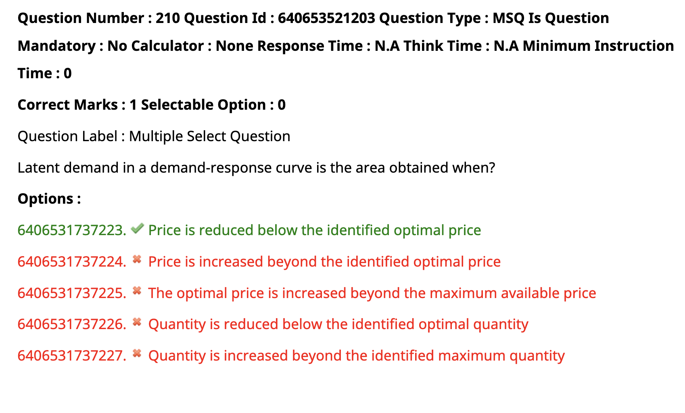
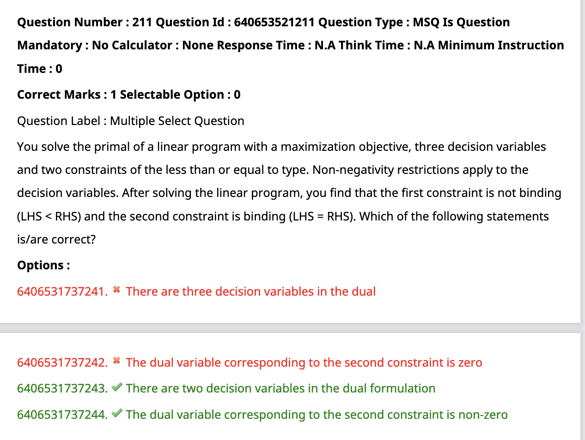

- 
    - Latent demand refers to demand for a good or service that consumers cannot satisfy for three main reasons. First, 
        - the consumer does not have enough money to buy the item.
        -  Second, the item is not available. 
        - Third, the consumer does not know that the product or service is available.
    - An example of latent demand is renewable energy sources for consumer use. Solar panels have become more available but many consumers' budgets and locations prevent solar energy from being a good option for them.
- 
