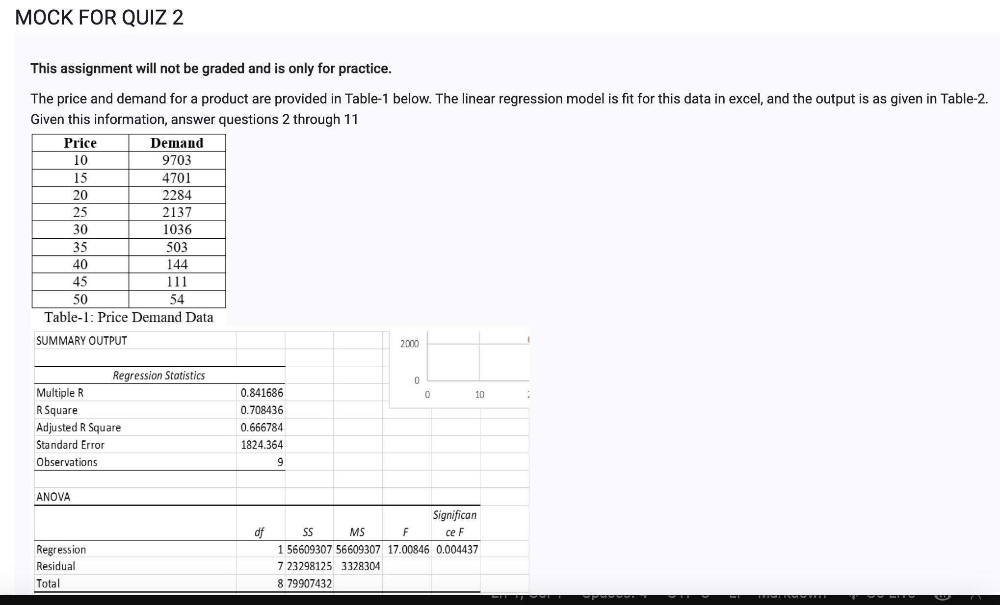
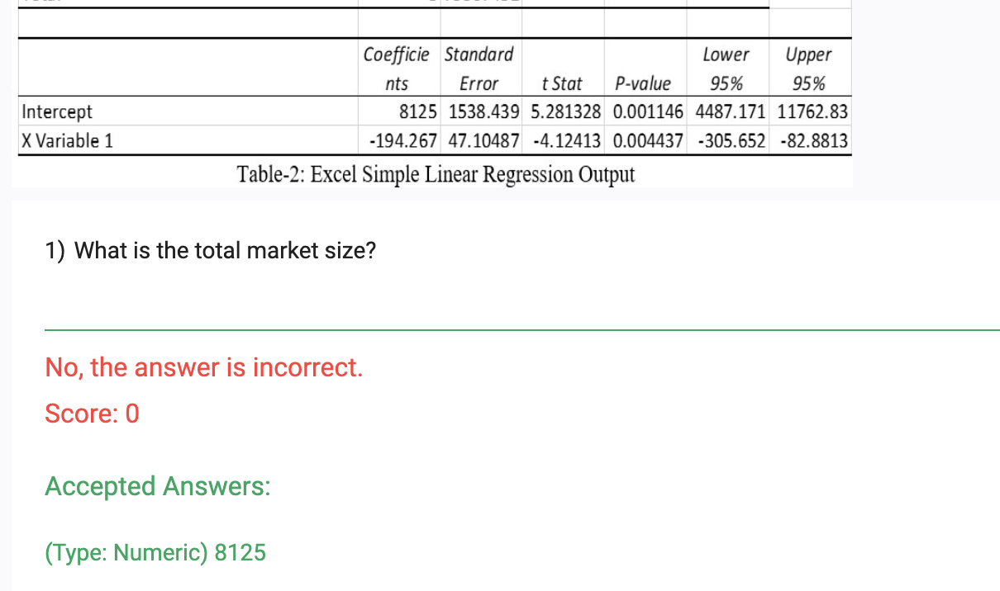
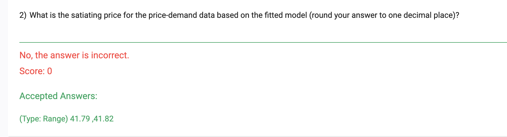

- total market size is `coefficients -intercept` 
- market size means the number of people who are willing to pay for the product, so it is the number of people who are willing to pay for the product at the price of 0
- the market size is 1000, which means that 1000 people are willing to pay for the product at the price of 0
- it is the coefficient of the price variable in the linear regression model because the price variable is the only variable in the models

- the satiation point is the point where the price is so high that no one is willing to pay for the product
- the satiation point is 100, which means that when the price is 100, no one is willing to pay for the product
- the satiation point is the intercept of the linear regression model because the price variable is the only variable in the model

- 
What is the satiating price for the price-demand data based on the fitted model (round your answer to one decimal place)?

