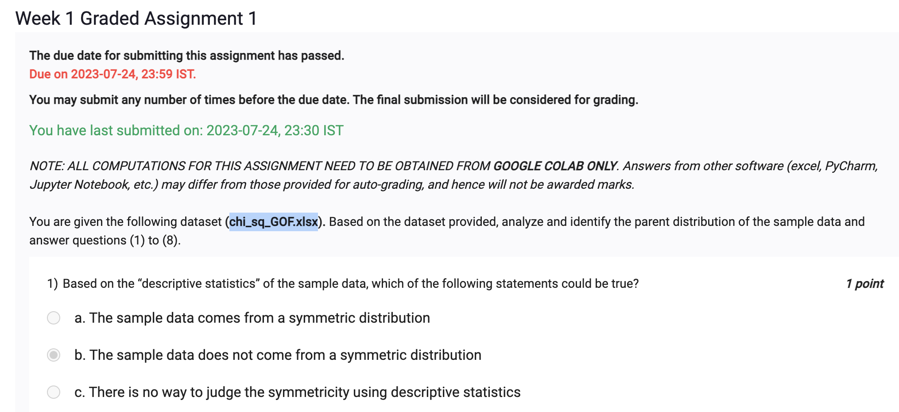

```
import pandas as pd

data=pd.read_csv('https://docs.google.com/spreadsheets/d/e/2PACX-1vRDZkwZBRxDBglsORcnrTJM3JDe5lmd8o-j-J8EYmKwcTKGpWzkN70CvBKlcopd4A/pub?output=csv')

data.shape
print(data.data.skew())
print(data.data.describe())
print(data.data.hist())
```


