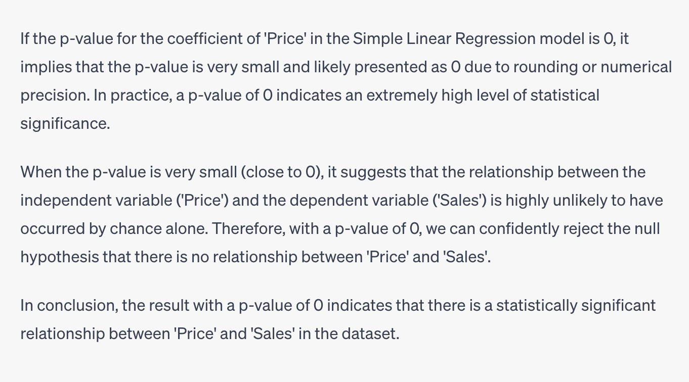

1) r2score?
Ans = 0.53
```
import pandas as pd
data=pd.read_csv('https://docs.google.com/spreadsheets/d/e/2PACX-1vR0Iu2KxxxE1C6cuiK3aAGxDS7WcAELJAfV1voHtAt50wWwsxmSn_u78ezIRbPlqQ/pub?output=csv')
data.head()
!pip install statsmodels
import statsmodels.formula.api as smf
model = smf.ols('Sales ~ Price', data=data).fit()
model.rsquared
```

2) is this significant?
Ans = Yes
```
model.pvalues
```
-  op:
  - Intercept    3.114403e-17
    Price        2.521315e-09

- The p_value_price variable will now contain the p-value associated with the coefficient of 'Price' in the regression model. The p-value helps determine the statistical significance of the relationship between 'Price' and 'Sales'. If the p-value is less than a chosen significance level (commonly 0.05), then we can reject the null hypothesis and conclude that there is a significant relationship between 'Price' and 'Sales'.

- 

3) What is the value of the intercept?

Ans = 110.6
```
model.params
```
- op:
  - Intercept    110.595308
    Price        -21.205211

- The intercept represents the value of the dependent variable ('Sales') when the independent variable ('Price') is 0. However, it's important to interpret the intercept in context because, in many real-world scenarios, an intercept of 0 may not have a practical meaning. For example, if we were to predict the number of sales of a product based on its price, it would not make sense to predict that 0 sales would occur if the price were 0. In this case, the intercept is not meaningful, and the model should be fit without an intercept.


4) What is the value of the slope?

Ans = -21.2
```
model.params
```
- slope is the coefficient of the independent variable. In this case, the slope is -21.2, which means that for every 1 unit increase in 'Price', 'Sales' will decrease by 21.2 units.

- Use natural log transformation and refit the model using the transformed dataset and answer questions (5) to (8)
Hint: Use np.log
5) What is the value of R2 of the transformed model?

```
import pandas as pd
import numpy as np

# Load the dataset from the Google Sheets URL
data_url = 'https://docs.google.com/spreadsheets/d/e/2PACX-1vR0Iu2KxxxE1C6cuiK3aAGxDS7WcAELJAfV1voHtAt50wWwsxmSn_u78ezIRbPlqQ/pub?output=csv'
data = pd.read_csv(data_url)

# Apply natural log transformation to 'Price' column
data['Log_Price'] = np.log(data['Price'])
data['Log_Sales'] = np.log(data['Sales'])


import statsmodels.formula.api as smf

# Fit the Simple Linear Regression model with the transformed dataset
model_transformed = smf.ols('Log_Sales ~ Log_Price', data=data).fit()

# Print the summary of the model
print(model_transformed.rsquared)

```

6) Is the model significant?

Ans = Yes
```
model_transformed.pvalues
```
- op:
  - Intercept    1.190626e-44
    Log_Price    2.101310e-15

- The p-value of the coefficient of 'Log_Price' is less than 0.05, which means that the relationship between 'Log_Price' and 'Log_Sales' is statistically significant.

7) What is the value of the intercept?

Ans = 4.78
```
model_transformed.params
```
- op:
  - Intercept    4.779307
    Log_Price   -0.989833

8) What is the value of the slope?

Ans = -0.99
```
model_transformed.params
```
- op:
  - Intercept    4.779307
    Log_Price   -0.989833


9)


```
X=pd.read_csv('https://docs.google.com/spreadsheets/d/e/2PACX-1vRaZpmL8jVdVZKVdz2AL_OUgPDAQZGS1Ftjx65TP9_5fFEgt8CSmfgmUUf0dshXrnFUSlALVCsBoocx/pub?output=csv',index_col='Unnamed: 0')
y=pd.read_csv('https://docs.google.com/spreadsheets/d/e/2PACX-1vTc3JMiHhCSxtsJyDvpntTyj7Z-gYrmVEhsyfUG58rtMGboKbqcYZP6Ypy4Dru6m5di3kdirX0JETM4/pub?output=csv',index_col='Unnamed: 0')
y.shape
from sklearn.model_selection import train_test_split
from sklearn.linear_model import LinearRegression
from sklearn.metrics import r2_score
X_train, X_test, y_train, y_test = train_test_split(X, y, test_size=0.2, random_state=0)
model = LinearRegression()
model.fit(X_train, y_train)
y_pred = model.predict(X_test)
r2score = r2_score(y_test, y_pred)
np.round(r2score, 2)
```

10) 

model.intercept_.round(2)